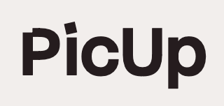

<a id="readme-top"></a>

<!-- PROJECT LOGO -->
<br />
<div align="center">
  <a href="https://github.com/larisssssa/pic-up">
    
  </a>

  <h4 align="center">PicUp - A Business Management Application for Photographers</h4>
</div>

<!-- ABOUT THE PROJECT -->

## About The Project

PicUp is an application for photographers to organize their business through project and client management. PicUp offers the following capabilities:
For Project Management:

- Create new projects
- Delete projects
- View Project Details
- Update project status

<p align="right">(<a href="#readme-top">back to top</a>)</p>

### Built With

- ![React.js]
- ![Javascript]
- ![HTML5]
- ![CSS]

<p align="right">(<a href="#readme-top">back to top</a>)</p>

<!-- GETTING STARTED -->

## Getting Started

### Prerequisites

1. Install npm
   ```sh
   npm install npm@latest -g
   ```

### Installation

1. Clone the repo
   ```sh
   git clone git@github.com:larisssssa/pic-up.git
   ```
1. Install NPM packages
   ```sh
   npm install
   ```
1. Start the server

   ```sh
   npm run dev
   ```

1. Open the server in your browser

<p align="right">(<a href="#readme-top">back to top</a>)</p>

<!-- ROADMAP -->

## Roadmap

- [x] CRUD capabilities
- [x] Create README
- [ ] Update CSS (Bulma or Tailwind)
- [ ] Add/remove photos from projects

<p align="right">(<a href="#readme-top">back to top</a>)</p>

<!-- CONTACT -->

## Contact

Your Name - [Larissa Ferreira](https://github.com/larisssssa)

Project Link: [https://github.com/larisssssa/pic-up](https://github.com/larisssssa/pic-up)

<p align="right">(<a href="#readme-top">back to top</a>)</p>

<!-- MARKDOWN LINKS & IMAGES -->

[React.js]: https://img.shields.io/badge/React-20232A?style=for-the-badge&logo=react&logoColor=61DAFB
[JavaScript]: https://img.shields.io/badge/javascript-%23323330.svg?style=for-the-badge&logo=javascript&logoColor=%23F7DF1E
[HTML5]: https://img.shields.io/badge/html5-%23E34F26.svg?style=for-the-badge&logo=html5&logoColor=white
[CSS]: https://img.shields.io/badge/css-%23663399.svg?style=for-the-badge&logo=css&logoColor=white
